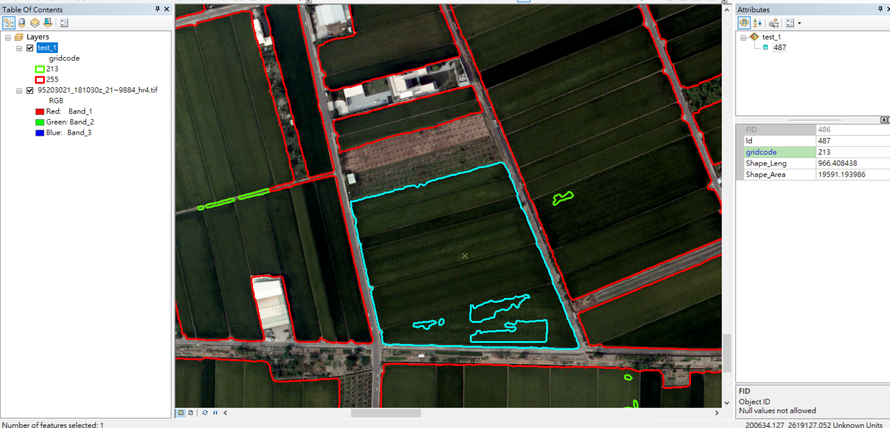

# png_2_shp
Simple scripts to convert png files generated by the NCU image segmentation models into arcgis shp files.
# Requirements
1. arcpy(should come with arcgis)  
# Usage
1. Create directories 'png_files', 'shp_files'  
```
mkdir png_files
mkdir shp_files
```
2. Move the prediction mask into .\png_files.  Make sure the dimensions of the prediction mask matches the orignial .tiff (in our case 11460x12260). If it doesn't, run this to resize.
```
py .\resize_png.py
```
3. Move the accompanying .pgw into \png_files. If you do not have the .pgw file, generate one by running this script with the python provided by arcgis. 
```
C:\Python27\ArcGIS10.8\python.exe .\raster_2_word_file.py
```
4. Name the .pgw file the same as the .png file, and move it into ./png_files.
5. Run raster_2_shp.py with the python provided by arcgis.
```
C:\Python27\ArcGIS10.8\python.exe .\raster_2_shp.py 
```
6. verify the results by overlaying test.shp onto the original .tiff.  

